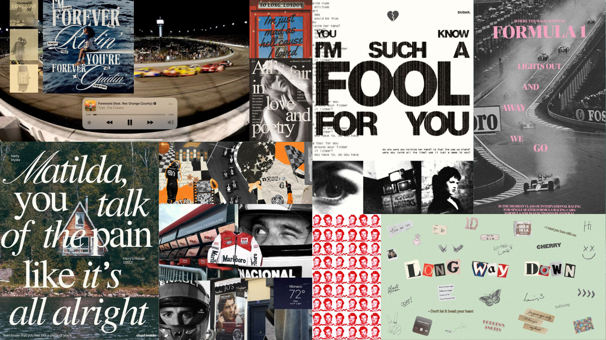

# Design-Chronicles 

> “I create chaos that makes sense.” 
A curated collection of brand-inspired designs, some professional, some playful, all uniquely crafted. This repository houses portfolio pieces, experimental visuals, and resumes transformed into art, reflecting creative journeys across different industries and identities.

## Designs by Me :) 

This repository is a curated archive of my design work:  blending brand collaborations, conceptual experiments, storytelling visuals, and uniquely styled resumes.

## What's Inside

- Brand assets and campaign visuals
- Personal design experiments
- Creative resume formats
- Portfolio mockups and layout explorations

> “Every brand tells a story, and every design is a whisper in its language.”
